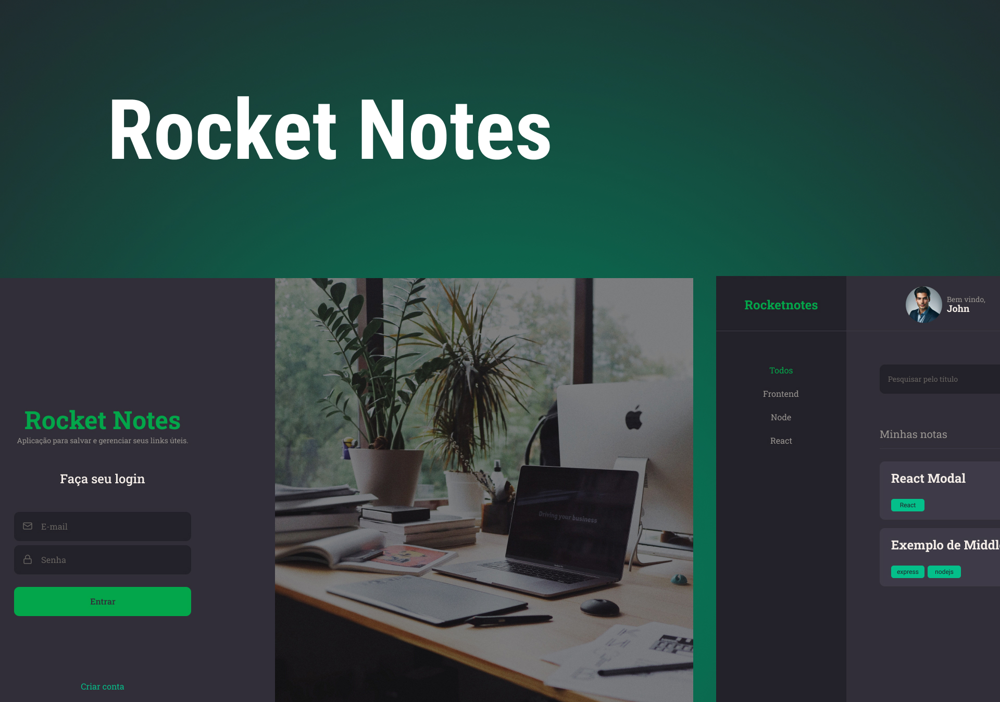

<p align="center">
  
  
  
  
  <a href="https://github.com/henriquencorrea/rocketnotes-frontend/commits/master">
  
  </a>
</p>

</br>

<p align="center">
                               |
 <a href="#-about">About</a>   |
 <a href="#-layout">Layout</a> | 
 <a href="#-deploy">Deploy</a> |

</p>


## 💬 About

  RocketNotes is a project developed by Rocketseat's Explorer course.
  Our objective is to create a simple system using modern technologies such as React, Vite, React Router DOM, Styled Components, and React Icons.

  With RocketNotes, you can register and create notes on specific subjects in an organized manner.
  You can add a title, description, links, and tags for each note, as well as edit your profile.
  You can easily modify your avatar, name, email, and password.
  I want to remind you that this project is part of the Explorer trail/course provided by Rocketseat for those who are interested.

</br></br>  
  
## 🎨 Layout

You can easily view the project layout by clicking on the provided <a href="https://www.figma.com/file/Z8Bw89VSqMUA0A2wg8Y1tz/RocketNotes-(Copy)-(Copy)?type=design&node-id=0-1&mode=design&t=jaJXPOJ0fHW6qNAF-0" target="_blank">link</a>.

<p align="center">
  

</br></br>  

## 🚀 Deploy

To access the application's website deployment, click on the following link: [Link](https://rocketnotes4u.netlify.app/)
> Note: the application may take a while to start running after a while, due to the back-end running through the free plan on the hosting platform.

<p align="center">
 
</p>

</br></br> 

## 👷  How it works

This project contains a Front-end (React) and Back-end (Node) part, however, this repository is only the Front-end Web part,
to access the Back-end repository go to the following <a href="https://github.com/henriquencorrea/Rocketnotes-backend">Link</a> 

#### ⏳ Running the web application (Frontend)

```bash
# Clone this repository
$ git clone git@github.com:henriquencorrea/rocketnotes-frontend.git

# Go to the Front End application folder
$ cd rocketnotes-frontend

# Install the dependencies
$ npm install

# Run the application in development mode
$ npm run dev

# The application will be opened on a port specified in the run terminal
```
  


  
